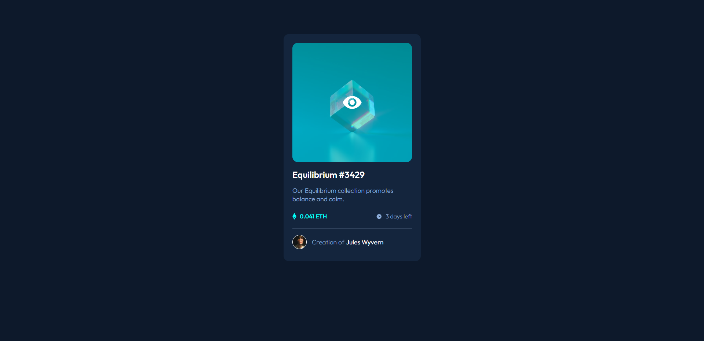

# Frontend Mentor - NFT preview card component solution

This is my solution of the NFT preview card challenge. Pretty happy with the result.

## Built with

- Semantic HTML5 markup
- CSS custom properties
- Flexbox

### Screenshots

Desktop design:

Mobile design:

Picture hover: 

Header hover: 

Name hover: 

### Links

- Live Site URL: [NFT Card](https://kacperoni.github.io/nft-preview-card-component-main/)

### What I learned
Improved my flexbox skills, learned more about position relative and absolute. Started using rem instead of px in font sizes as well.