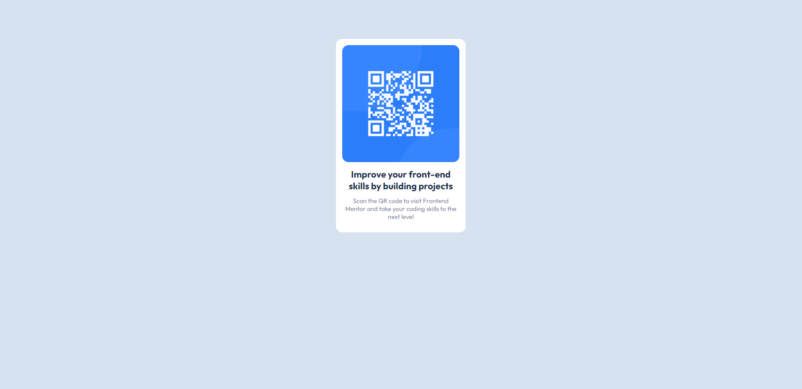

# Frontend Mentor - QR code component solution

My first challenge, simply landing page basic stuff.

## Built with

- Semantic HTML5 markup
- CSS custom properties
- Flexbox

### Screenshots

Desktop design:

Mobile design:

### Links

- Live Site URL: [Live site URL](https://kacperoni.github.io/qr-code-component-main/)
