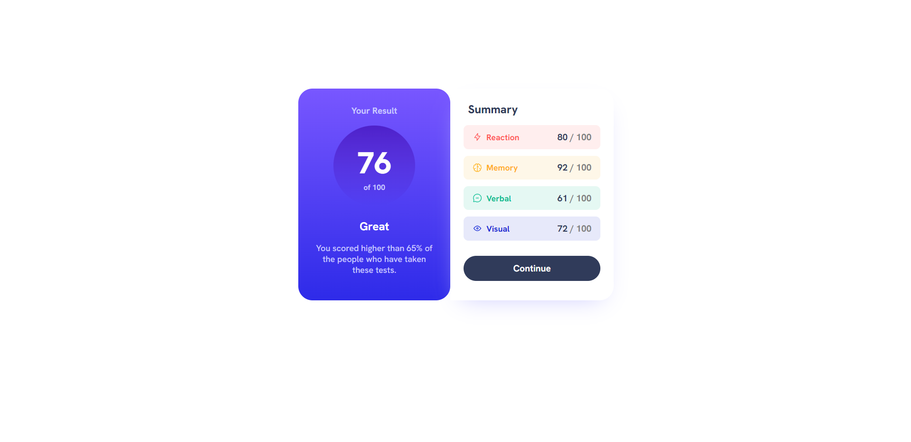
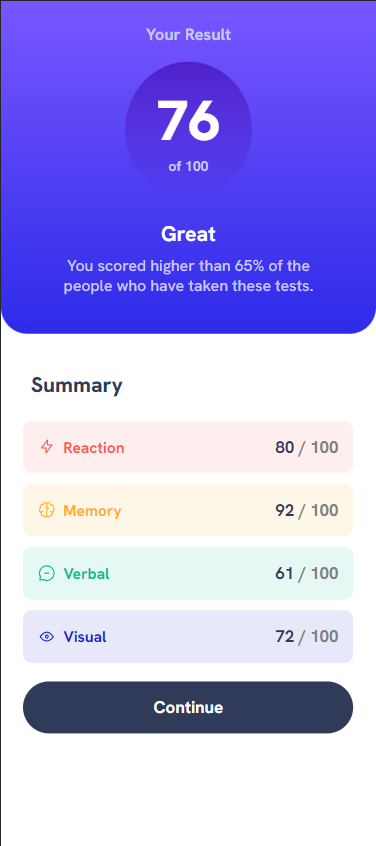

# Frontend Mentor - QR code component solution

Third challange, took me a little bit more time. Learned more about responsive websites, box shadow. Not sure if I used h1,h2,h3 tags correct.

## Built with

- Semantic HTML5 markup
- CSS custom properties
- Flexbox

### Screenshots

Desktop design:

Active states:

Mobile design:

### Links

- Live Site URL: [Results Summary](https://kacperoni.github.io/results-summary-component-main/index.html)
